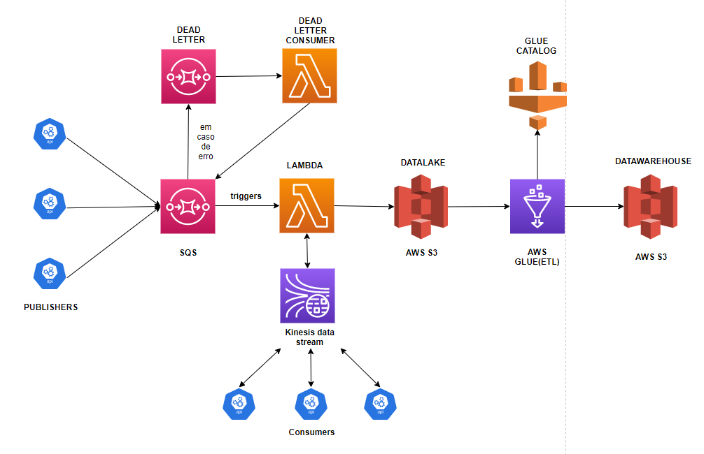

# POC DATAWAREHOUSE
---
## Objetivo
- Entender como funcionam os serviços de datalake e datawarehouse aws
- Validar arquitetura sugerida para injestão de dados

---

# Desenho das Arquiteturas (que estou validando até então)



- A ideia desta arquitetura é entender como funcionam os serviços da AWS, e como disponibilizar os dados para integradores externos e armazenar estes dados para posterior análise.

# Requerimentos
- AWS CLI - https://docs.aws.amazon.com/cli/latest/userguide/install-cliv2-windows.html
- TERRAFORM - https://learn.hashicorp.com/tutorials/terraform/install-cli

# Como rodar:
__Linux ou MacOS__
```
export AWS_ACCESS_KEY_ID=<< Seu ID de acesso >>
export AWS_SECRET_ACCESS_KEY=<< Sua Chave de acesso>>
export AWS_DEFAULT_REGION=<< Região >>
```
__Windows CommandPrompt__ 

```
setx AWS_ACCESS_KEY_ID=<< Seu ID de acesso >>
setx AWS_SECRET_ACCESS_KEY=<< Sua Chave de acesso>>
setx AWS_DEFAULT_REGION=<< Região >>
```
__Windows PowerShell__ 
```
$Env:AWS_ACCESS_KEY_ID=<< Seu ID de acesso >>
$Env:AWS_SECRET_ACCESS_KEY=<< Sua Chave de acesso>>
$Env:AWS_DEFAULT_REGION="us-east-1"
```

## Crie um bucket no AWS S3 para servir como seu remote backend
Crie um bucket no AWS S3 manualmente e edite o seu arquivo `terraform/staging/backend.tf`
Neste S3 ficarão guardados os tfstates do terraform, isso é necessário para utilizarmos o terraform.

## Inicializar Terraform (Pelo linux podemos utilizar o makefile, caso contrário execute o comando)
Depois de definidas as variáveis de ambiente, execute o commando:
```
make init ENVIRONMENT=staging
ou
cd terraform/staging && terraform init  -reconfigure

```

## Terraform Plan
Para realizar o Terraform Plan, você deverá executar o seguinte comando: 
```
make plan
ou
cd terraform/staging && terraform plan

```

## Terraform Apply
Para criar todos os recursos em sua conta na aws
```
make apply
ou
cd terraform/staging && terraform apply

```

## Terraform destroy
Para destruir a arquitetura e deletar todos os recursos da aws que foram criados no apply
```
make destroy
ou
cd terraform/staging && terraform destroy

```

## Neste projeto temos um publisher que pode ser utilizado para validar o ambiente
Entre em /app e preencha as seguintes variáveis de ambiente
```
KINESIS_STREAM_NAME=NOME_DA_STREAM_QUE_ESTA_NO_TERRAFORM
KINESIS_REGION=us-east-1
AWS_ENDPOINT=kinesis.us-east-1.amazonaws.com
AWS_ACCESS_KEY_ID=GERAR_PELA_CLI
AWS_SECRET_ACCESS_KEY=GERAR_PELA_CLI
AWS_SESSION_TOKEN=GERAR_PELA_CLI
```

Para pegar este dado utilizamos a CLI da AWS e fazemos

```
aws sts get-session-token --duration-seconds 900 
```

Agora basta executar o arquivo publisher.go e verá que os dados do arquivo data.json aparecerão no S3.